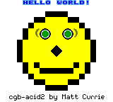

# Beethoven Game Boy Emulator



This is the Game Boy / Game Boy Color demo for Beethoven on AUP-ZU3. The short version: the Game Boy core runs in the FPGA fabric, Linux on the Zynq PS loads your ROM, owns the window/input/audio path, and the two sides talk through Beethoven commands plus shared DDR buffers. It is meant to be a real board demo, not a polished desktop emulator.

## TL;DR

If you only want to see whether the project still builds and simulates, install Verilator, build the Beethoven project, build the small host bridge, and run the smoke script:

```bash
cd Beethoven-Zoo/GameBoy
sudo apt-get update
sudo apt-get install -y build-essential cmake verilator python3

beethoven build
beethoven build runtime --simulation
cmake -S sw -B sw/build
cmake --build sw/build -j4
python3 scripts/host_smoke.py
python3 scripts/sim_smoke.py
```

`host_smoke.py` should end with `host_smoke ok`. `sim_smoke.py` starts the simulation runtime, creates synthetic ROMs under `target/sim-smoke/`, and should print `bridge_roundtrip ok`, `core_smoke ok`, and `persistence_smoke ok`.

## ROMs

This repo includes `tobudx.gbc`, an open-source GBC ROM that is useful as the
default sanity check. You can also pass your own `.gb` or `.gbc` file when
running the host. Save RAM and MBC3 RTC state are kept next to the ROM as
`.sav` and `.rtc` files, so treat that directory as writable. If a ROM fails
immediately, check the cartridge type first; the loader rejects unsupported
mappers instead of pretending they work.

## Running on the board

Build or copy the AArch64 runtime and host bridge onto the ZU3, program the PL, start the Beethoven runtime, then launch the Python host. The normal interactive shape is:

```bash
PYTHONPATH=sw python3 -m gameboy_host \
  --rom path/to/game.gbc \
  --run \
  --gtk \
  --no-audio
```

For the bundled TobuDX ROM, the concrete board command is:

```bash
PYTHONPATH=sw python3 -m gameboy_host \
  --rom tobudx.gbc \
  --run \
  --gtk \
  --no-audio
```

That should open a GTK window and run the included game through the PL core. The
same command works with another ROM by changing only the `--rom` path.

Drop `--no-audio` once the board's Linux audio path is behaving, or pass `--audio-device hw:0,0` if you want to force an ALSA PCM. The GUI path needs PyGObject/GTK3, and audio uses `aplay`; on Ubuntu-style images that usually means `python3-gi`, `gir1.2-gtk-3.0`, and `alsa-utils`. Add `--gamepad` to poll a Linux `/dev/input/event*` gamepad while the GTK window is open. The keyboard mapping is intentionally boring: arrows are the D-pad, `z` is A, `x` is B, `a` is Select, and `s` is Start.

For first board bring-up, do not freestyle it. Use `docs/board-bringup.md`; it has the exact runtime build, PL programming, hugepage, `/dev/mem`, smoke-test, and GUI screenshot checks.

## Verilator note

GameBoy explicitly sets `simulator = "verilator"` in `Beethoven.toml`. Ubuntu 24.04's `verilator` package is currently 5.020, which satisfies Beethoven's runtime CMake check:

```text
find_package(verilator REQUIRED VERSION 5.0.0)
```

Do not switch this project to Icarus just to avoid installing Verilator. The generated microcode table RTL currently uses SystemVerilog assignment patterns that Icarus cannot elaborate.

## What is actually happening

The PS side is just Linux software: Python/GTK for the window, Linux input for controls, `aplay` for audio, and normal files for ROM/save data. The PL side is the integrated Game Boy core plus a Beethoven wrapper. Shared DDR carries ROM reads, save-RAM traffic, triple-buffered RGB555 frames, and an audio ring. Beethoven commands handle configure, run/reset/input, status, RTC, and debug.

```text
ROM/save files + GTK/input/audio on Linux PS
        <-> Beethoven bridge + shared DDR buffers
        <-> Game Boy core in Zynq PL
```

That split is the point of the demo: no PL HDMI, no PL audio codec, no cartridge slot, no link cable. Those are out of scope for this version.

## Current rough edges

Simulation and smoke tests require Verilator. Board GUI smoke has matched the `cgb-acid2` reference image, but physical audio playback on the current board image is still flaky, so automated checks use `--alsa-null` or `--no-audio`. Physical keyboard/gamepad testing depends on what input devices Linux exposes on the board.

## Useful files

`docs/interfaces.md` is the PS/PL contract. `docs/beethoven-interfaces.md` explains which Beethoven pieces are used and why. `docs/board-bringup.md` is the board checklist. `sw/gameboy_host/` is the Python host, `sw/gameboy_bridge.cc` is the C++ bridge, and `hw/src/main/scala/gameboy_zu3/` is the Beethoven wrapper around the core.

## Credits

The Game Boy / Game Boy Color core under `hw/src/main/scala/gameboy/**` is derived from the GPLv3 Game Bub project and adapted for this Beethoven/ZU3 example. Game Bub is the upstream reference, but it is not vendored here and is not a build-time dependency.

Upstream: <https://github.com/elipsitz/gamebub>
